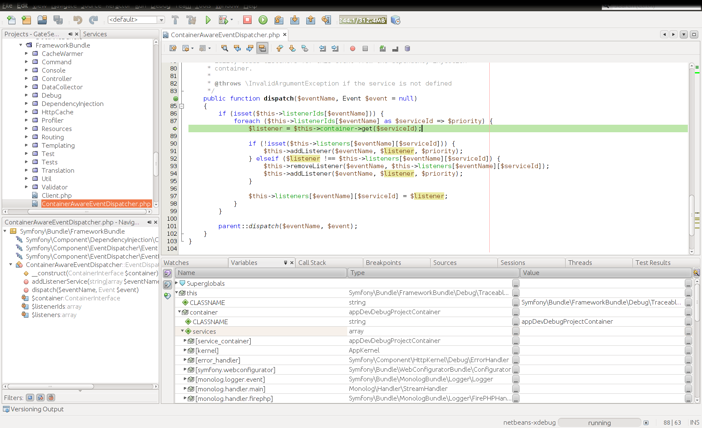
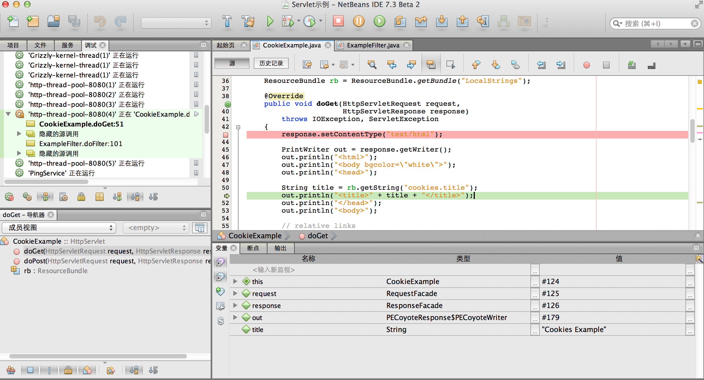

# 5. 理解源代码

在这一章中，只打算讨论以命令式编程范型为主的语言，因为其他的编程范型的开源项目，笔者接触太少了（期待各类达人多多补充）。

## 5.1. 静态理解

阅读一个开源项目的源代码，通常都很容易。大多数开源项目的托管网站，都提供了无需下载，直接阅读源代码的功能，比较有趣的是，大家可以比较一下 sourceforge、google code以及github的查看源代码的功能。这分别代表了老、中、青三代开源托管平台，对于查看代码的重视程度。

### 5.1.1. 目录结构

好的开源项目，通常会选择合理的目录结构，来组织自己的代码。而所谓合理，通常意味着遵循最常见的约定俗成。比如：

|目录名|含义|
|------|----|
|conf/configure|各种配置文件|
|src/source|项目的源代码|
|doc/document|项目文档|
|test/unittest|单元测试|
|tools/utils|相关工具|
|lib|库文件|
|app|应用相关的文件（在web项目中经常出现）|
|controllers|控制器，在遵循MVC模式的Web项目中，经常出现|
|models|模型，在遵循MVC模式的Web项目中，经常出现|
|views|视图，在遵循MVC模式的Web项目中，经常出现|
|db|数据库相关文件|
|demo/example|相关示例代码|
|misc|其他杂项|
|include|头文件所在目录，c/c++项目中常见|
|out/build|编译结果输出目录|
|third_party/vender|第三方库|
|install|安装所需的相关文件|

### 5.1.2. 包名与文件名

在软件体系中，包（Package）是一个很重要的概念，与模块（Module）类似，但是又有所区别。一个项目，在初始设计时，就需要做模块划分，每一个大小合适的模块，往往就可以作为一个开发工作单元，分配给某个开发者完成。当然，对于那种大型的、复杂的项目，还需对模块做进一步的细分，比如：子模块（Sub Module）。而包（Package），则往往具有一定的可重用性。我们可以认为，一个模块，开源出去未必会有人来用。而一个设计良好的包，本身就可以作为一个开源项目，放出去给被人使用。

因此，从更加有利于软件开发的协作的角度来说，合理的包命名，就变得非常重要。

越是现代的开源项目，越是懂得不必一切从零开始搭建，所以，我们常常会发现，一个开源项目，他们自己会开发一组Package，同时也依赖一批别人开发的Package。在静态理解项目时，了解一个项目项目有哪些包，以及依赖哪些包，就非常重要。

举例之一：rails是一个著名的ruby开源项目。我们访问它的[github主页](https://github.com/rails/rails)，就可以看到这个项目的源代码结构。

* 首先需要选择查看某一个稳定版本，比如3.2版
    * https://github.com/rails/rails/tree/3-2-stable
* 然后阅读install.rb文件
    * https://github.com/rails/rails/blob/3-2-stable/install.rb
* 我们可以看到的内容，主要包含两大部分：
    * 编译rails的依赖包：activesupport、activemodel、activerecord、activeresource、actionpack、actionmailer、railties。这些都是rails项目自己开发的包
    * 然后再编译rails本身
* rails本身的包描述文件是：rails.gemspec
    * https://github.com/rails/rails/blob/3-2-stable/rails.gemspec
* 通过阅读rails.gemspec，我们可以了解到，rails这个项目，依赖的包还包括：bundler、sprockets-rails。
    * 事实上，通过阅读activesupport等一系列包的.gemspec文件，我们还会发现更多的外部依赖包。

不同的项目，描述包文件，以及包依赖关系，有各种不同的格式。需要一一分别学习。这里就不再详细解说了。

在一个开源项目中，代码当然是由一个一个的源代码文件组成的。通过查看文件名，往往可以了解一个文件的大概内容。例如：

* errors.rb，通常会与出错处理有关
* i18n.rb，通常会与国际化有关
* logger.rb，通常会与日志有关
* json目录下的两个文件decoding.rb和encoding.rb，自然是JSON格式的编解码相关代码

通常，要迅速的辨认出一个文件名的含义，与领域知识大有关系。例如：http.rb，通常会是处理http协议相关。而request和response，则通常是网络协议中的请求与响应相关的处理代码。对于这些单词的熟悉程度，决定了我们阅读与理解代码的迅捷程度。

### 5.1.3. 类名、函数名与变量名

java是一门很讲究规范的语言,所以他的每一个类，就会对应一个同名的.java文件（内部类除外）。这使得我们寻找类所在的源文件，变得非常简单。当然，这样会造成源文件数量的增加，也许会有人不喜欢。

不同的语言，对于命名有其自己的规范，我们可以做一个列表，来简单列出这些规范。

|语言|包/命名空间命名|类命名|函数/方法命名|常量命名|变量命名|
|----|---------------|------|-------------|--------|--------|
|Java|domainname.package 全部都是小写的单词，以.区隔|ThisClassName 每个单词都以大写字母开头|theMethodName 第一个单词以小写字母开头|THE_VALUE 全部大写，单词以下划线分隔|theValue 与函数名一致|
|C#|DomainName.Package 每个单词都以大写字母开头，以.区隔|ThisClassName 每个单词都以大写字母开头|TheMethondName 与类名一致|THE_VALUE 全部大写，单词以下划线分隔|TheValue 与类名一致|
|PHP|domainname.package 全部都是小写的单词，以.区隔|ThisClassName 每个单词都以大写字母开头|theMethodName 第一个单词以小写字母开头|$THE_VALUE 全部大写，单词以下划线分隔|$theValue 与函数名一致|
|C/C++|std::hex 全部小写，以::区隔|CThisClassName 以大写C开头，后续是大写字母开头的单词|TheMethodName 每个单词以大写字母开头|nMAX_VALUE 特别会引入前缀的概念，例如：n代表整形、b代表布尔型、c代表字符型等等|nTheValue 与常量类似，单词区分大小写|
|Delphi|MyUnit.Unit2 遵循Pascal命名法:一个名字里如果包含多个单词，每个单词的首字母都要大写，以.区隔|TThisClassName 以大写T开头，后续是大写字母开头的单词|TheMethodName 每个单词以大写字母开头|castMaxValue 特别会引入前缀的概念，例如：i代表整形、b代表布尔型、c代表字符型等等，cast代表常量|iTheValue 与常量类似，单词区分大小写|
|Ruby|Module::SubModule 每个单词以大写开头，以::区隔|ThisClassName 每个单词都以大写字母开头|the_method_name 全小写单词，以下划线分隔，!?有特定的含义|MAX_VALUE 全大写单词，以下划线分隔|the_value 全小写单词，以下划线分隔|
|Python|mod_submod 全部小写，以_区隔|ThisClassName 每个单词都以大写字母开头|the_method_name/theMethodName 全小写单词，以下划线分隔，也可以类似Java的命名，私有函数以双下划线开头|MAX_VALUE 全大写，以下划线分隔|the_value 全小写，以下划线分隔|
|JavaScript|无|ThisClassName 每个单词都以大写字母开头|thePrivateMethod/ThePublicMethod 私有函数小写字母开头，公有函数以大写字母开头|MAX_VALUE 全大写，下划线分隔|theValue 小写字母开头，私有变量，加下划线|

这是一个非常粗略，挂一漏万的表格，详细的命名规范，请参考各种具体语言的命名规范文档。

### 5.1.4. 注释与Readme

很多时候，开源项目代码里的注释，会给你带来误导。或者会让人不知所云，或者只是写给自己看到TODO，或者代码改了，注释忘记改。种种原因，因此我强烈的不建议过于重视注释。

但是，在业内有一种流派，非常重视注释，而且信奉从源代码的注释，就可以直接生成项目的开发文档。比如JavaDoc这样的东西，在java的开源项目里，简直用到泛滥，也造成了java的很多项目，注释数量比代码的数量还要多。而且，格式规范，千篇一律（为了生成Document），真正有意义的注释内容，少之又少。纯粹是干扰阅读。

很多时候，我都建议阅读代码，就真的去读代码。然后试着从类名、方法名、变量名中，大致“猜出”代码的意义。然后再实际的将代码运行起来，看看执行过程中，这些代码是如何工作的。

总之，不到万不得已，不要先看注释。

虽然我个人对于注释，相当的不重视，但是却非常认同Readme的价值。令我倍感欣慰的是，Github的创立者，也完全赞成这一点。他们将一个项目的首页，直接规定为“代码展示+Readme”，也就强迫所有在Github上安家的开源项目，将更多的精力，投注到Readme的撰写中去。这样形成的良性循环，使得我们可以乐观的预期：越来越多的开源软件，将会越来越重视项目根目录下的Readme文件的价值，将一个项目最为重要的内容，以最为精炼的方式，在Readme中，以结构良好的方式，展现出来。

因此，首先阅读Readme，对于了解一个开源项目，是一个非常好的选择。

### 5.1.5. UML图

UML是一种软件建模语言，全称为：统一建模语言（UML，Unified Modeling Language）。非常巧合的是，在打算写这一小节的今天，@蔡学庸 发了两条微博：

> 有时候我会一边读源码，一边将我的理解画成图。这是我最近读源码画的图，还没有美化处理。
> 
> 阅读源代码时，将代码顺手图像化，有助于我思考与记忆。位置、色彩、形状，这些都是我将源代码图像化时会采用的手段。

我非常期待，他能够就这个问题，谈到更多的心得。在我看来，在阅读源代码的时候，不断记录，在脑海里形成整个项目的全景图像，是非常有帮助的。

关于UML的定义，可以参考维基百科： [UML](http://zh.wikipedia.org/wiki/UML)，以下引用一段：

> 统一建模语言（UML，Unified Modeling Language）是非专利的第三代建模和规约语言。UML是一种开放的方法，用于说明、可视化、构建和编写一个正在开发的、面向对象的、软件密集系统的制品的开放方法。UML展现了一系列最佳工程实践，这些最佳实践在对大规模，复杂系统进行建模方面，特别是在软件架构层次已经被验证有效。
> 
> UML集成了Booch，OMT和面向对象软件工程的概念，将这些方法融合为单一的，通用的，并且可以广泛使用的建模语言。UML打算成为可以对并发和分布式系统的标准建模语言。
> 
> UML 并不是一个工业标准，但在Object Management Group的主持和资助下，UML正在逐渐成为工业标准。OMG 之前曾经呼吁业界向其提供有关对象导向的理论及实现的方法，以便制作一个严谨的软件建模语言（Software Modeling Language）。
> 
> 有很多业界的领袖亦真诚地回应OMG，帮助她建立一个业界标准。

在UML系统开发中有三个主要的模型：

* **功能模型**： 从用户的角度展示系统的功能，包括用例图。
* **对象模型**： 采用对象，属性，操作，关联等概念展示系统的结构和基础，包括类图。
* **动态模型**： 展现系统的内部行为。包括序列图，活动图，状态图。

在学习开源软件时如何使用UML，有以下一些经验和忠告：

* 不用使用工具，自动化的生成UML。自己手绘或者用Umbrello这样的开源工具自己绘制，将大大提高阅读并理解代码的能力。
* 首先建立对象的静态模型，也就是先画“类图”。
* 在UML规范之外，可以加一些辅助自己记忆的符号，这个没有一定的规矩，方便好记就行。
* 其次在动态理解的过程中，对关键的执行路径，画出时序图（Sequence Diagram），将有助于深入理解项目的执行过程。
* 对于非面向对象的软件项目，可以参照类图与组件图的模式，画出模块图。也有助于加深理解。
* UML本身有越来越复杂，越来越学术化的倾向，要适可而止。

### 5.1.6. 外部文档

开源项目的文档水平，有如下几个层次：

* 没有文档（比这个更糟糕的，是有一些错漏的，长时间没有更新的垃圾文档）
* 有一个根据代码注释自动生成的XXDoc，通常这样的文档，价值很低。还不如直接去看代码。
* 有一个简单的综述性质的文档，至少告诉你一个项目的大概。
* 有完整的项目文档，这样的项目已经非常罕见了。
* 有各国志愿者帮助翻译的多语言文档。这样的项目，通常已经是世界一流的项目了。
* 有专门的文档、博客、甚至图书，《XX项目源码解读》之类。一般只有Linux、MySQL这样的项目，才有这样的待遇吧。

一般来说，外部文档的可信度并不高，而且往往过时。不到走投无路，我不建议找外部文档来帮助理解。当然，一些太复杂的项目，作为入门导引，看看也无妨。

ZoomQuiet补充：可以借用 CMMI 的几个层次来类比出文档的层次:

* 0级: 无文档
* 1级: 号称有文档
* 2级: 有可用文档
* 3级: 文档完备
* 4级: 文档丰富
* 5级: 文档开放,可持续完善

## 5.2. 动态理解

所谓动态理解，就是让项目运行起来，在运行项目的过程中，理解一个项目是如何运行的。（这个有点像绕口令了。。。）

### 5.2.1. 输出日志

所谓日志，在软件领域，通常是指程序运行的一种记录。开发者与维护人员，可以通过分析日志，了解程序的运行状况。日志输出的数量多寡，可以分为以下几种：

* 完全没有输出（这不是一种好的做法）
* 有出错与崩溃时的输出日志（主要用于排除故障）
* 打开某个参数配置的开关，例如将日志级别修改为debug，将会输出更多的日志信息（主要用于调试程序）
* 为了理解特定的片段，直接修改代码，增加更多的日志输出，甚至将代码执行过程中的所有相关变量，全都输出出来。（用于查找疑难杂症，深入理解源代码等目的。）

ZoomQuiet补充：同前,应该使用相同的递进分析层次

* 0级: 无日志
* 1级: 号称有日志
* 2级: 有可用日志
* 3级: 日志级别完备
* 4级: 日志粒度可调节
* 5级: 有通用日志服务,可集中分析

一个比较完善的开源项目，通常会输出一些日志，如果你搜索整个项目的源代码，都找不到（log，logger，logging）这样的关键字，那就比较糟糕了。

通过修改源代码，以增加更多的日志输出，是我们常用的一种手段，最好是能够找到项目中可供参考的输出日志的办法，照着那个例子来改写。如果实在找不到，或者调用存在一些陷阱，也可以自己纯粹手工的添加日志输出代码。简单的举一个ruby的例子，下面的这一行代码，就可以输出一段内容到日志文件里去了。

    File.open("temp.log","a") { |f| f.puts("log info") }

输出日志，能够解决大多数情况下的理解需求，唯一可能会有陷阱的，则是**多线程程序输出的日志**，因为每次输出的内容可能次序不一致，因此需要特别小心。

### 5.2.2. 设置断点与单步跟踪

IDE有一个重要的好处，就是可以帮助程序员调试程序。在一个图形化界面里，跟踪调试程序，有着纯文字界面难以比拟的便利性。

Netbeans IDE 7.0 调试PHP的程序片段

在一个宽屏的显示器里，同时显示源代码树、对象结构、当前执行到的代码行、当前的各种变量值、调用序列、各个线程、输出内容等等等等，还是很爽的。
当然，要使得IDE能够调试一个开源项目，还是有很多琐碎的事情需要处理。例如：

* 如何在IDE中打开一个项目
* 如何在IDE中配置一个项目的依赖项
* 如何在IDE中编译并运行一个项目
* 如何在IDE中设置断点

这些如何，因语言、平台、IDE、版本、具体项目的不同，而有所区别。这里没法给出一个周到全面的解决方案，但是可以给一些搜索方面的建议：

* 假设要在Netbeans 7中打开一个开源的Java项目，可以搜索“how to open java project in netbeans 7”，然后我们可以找到一些文档：
    * http://netbeans.org/kb/docs/java/project-setup.html
    * http://stackoverflow.com/questions/4382619/how-can-i-open-non-netbeans-java-project-using-netbeans

当然，一定会有各种让人挠头的问题，各位多多尝试吧。另外推荐一本书，是张银奎写的《软件调试》，大部头。但是的确是一本好书！

http://book.douban.com/subject/3088353/

### 5.2.3. 抛出异常

有很多种语言，都支持异常处理，以及手动抛出异常。在特定的位置，将整个调用序列打印出来，可以方便我们快速的找到整个项目，是从何处开始，又是如何一层一层的调用，最终到达我们设置抛出异常的位置的。

在Java语言中，我们可以这么写：(new Exception()).printStackTrace();
在PHP语言中，我们可以直接调用函数：debug_backtrace();或者debug_print_backtrace();
在Ruby语言中，我们可以这么写：

    begin
      1/0
    rescue => exception
      puts exception.backtrace
    end

其他种类的语言，建议各位可以自行Google。

在调用了类似的函数之后，我们可以或者类似如下这样的输出：

    java.lang.Exception 
            at org.jruby.lexer.yacc.LexerSource.getSource(LexerSource.java:147) 
            at org.jruby.parser.Parser.parse(Parser.java:122) 
            at org.jruby.Ruby.parseFile(Ruby.java:1965) 
            at org.jruby.Ruby.parseFile(Ruby.java:1969) 
            at org.jruby.Ruby.parseFromMain(Ruby.java:364) 
            at org.jruby.Ruby.runFromMain(Ruby.java:327) 
            at org.jruby.Main.run(Main.java:214) 
            at org.jruby.Main.run(Main.java:100) 
            at org.jruby.Main.main(Main.java:84) 

以上信息，清楚的现实了某某源文件的某某行，发生了一个调用，进而在下一个源文件中的某个函数，被调用了。于是，我们就可以从抛出异常的代码，开始逐级回溯，阅读相应的代码片段。

### 5.2.4. 修改代码，破坏性尝试

在初步理解了项目代码之后，可以尝试做一些简单的修改，看看会发生什么。

* 编译错误

静态类型的语言，在这方面有更多优势，通过编译时给出的错误提示，你可以知道自己改坏了什么，以及为什么它被改坏了。比较令人头痛的，是用了各种复杂的模板语法的C++语言，这时候编译器可能会给出一些令人莫名其妙的报错信息，那你就抓瞎了。不过，开源初学者，一上手就去啃复杂的C++代码，也很难说是明智的选择。

* 运行时报错

与编译期报错类似，你也可以通过阅读一堆一堆的报错信息，了解代码是如何运作的，以及为什么原来不报错，现在就开始报错了。
不过，触发运行时报错，可能会有些困难，这涉及到你修改的代码，是处于主线还是支线位置，以及有多少相关功能，依赖于你所修改的代码。

* 功能失效

可以尝试注释掉一些代码，看看会发生什么事情，比如某个功能按钮失灵甚至消失。当然，对于JavaScript代码，我们常常会喜欢在某些位置加上alert，看看什么时候会弹出一个消息提示框，却什么事都没有完成。

* 走走捷径

我们常常会看到的一类代码，是长期发展完善后的产物。从接收消息，要处理某某事件开始，到真正去完成某某功能，其间还做了很多的额外工作，比如数据校验，纪录日志，触发其他消息等等，将这些代码全部注释掉，大多数功能都还是正常的，但是，会出各种意外，可以进一步做出各种尝试。（详见5.3. 主线与支线）

### 5.2.5. 工具

有很多辅助代码阅读工具，简单的介绍一些

* IDE类

既然是IDE，自然大多数都已经集成了相当不错的代码阅读功能，索引，反查，标注，自由跳转，通常都应有尽有。比较好的IDE，有Eclipse、Netbeans、IntelliJ IDEA、Visual Studio(Express)等等，各种面向专门语言的IDE还有很多，可以自行在Google搜索“Best XXX IDE”。

进阶阅读：[18 个最佳代码编辑器/IDE推荐](http://www.iteye.com/news/24235)

* 传统神器＋超牛插件

所谓传统神器，自然是指Emacs与VIM，这两款神器不能简单的以是否IDE来划分。他们都带有众多的插件，可以扩展出惊人的灵活性。

推荐阅读两篇文章：
[Emacs和它的朋友们——阅读源代码篇](http://baohaojun.github.com/reading-source-code-cn)
[自己动手定制一个高效阅读源代码的vim](http://zqwt.012.blog.163.com/blog/static/1204468420114194264789/)

* 专业工具

专业工具，通常也是由商业公司开发的收费软件，人家要挣钱，自然也要有拿得出手的好东西。这里推荐两款软件，更多介绍，请自行搜索相关介绍与教程：

* [Understand](http://www.scitools.com/index.php)
* [source insight](http://www.sourceinsight.com/)

* 软件工程相关工具

所谓软件工程的相关工具，主要是一些与面向对象概念相关的UML工具，比如IBM的Rational Rose、Sybase的Power Desinger、还有Borland的Together，都是大公司出品的一些大家伙。可以将面向对象语言（主要是Java）的项目，转换输出成为UML的各种图，有一定的参考价值，玩玩也不错。

## 5.3. 主线与支线

一个开源项目，我们总可以从中找到主要的功能与次要的、辅助的功能。一个系统从启动开始，到完成最核心的功能、任务，最后成功结束，就是一条主线。而各种可能达到的次要功能，就是支线。

一个项目在最初创建的时候，总有一组想要实现的核心功能，其他都是次要的目标。比如：我做一个BBS，要让用户能够登录，发言（或者回复评论他人的发言），退出登录。这就是主线。而：设置用户头像，版主的各种权限与管理功能，顶、 踩功能，帖子内投票，站内短信等等等等，都可以算是次要功能。

在一个项目中，首先清理出主线以及其相关的代码，是一个非常必要的工作，主要的入手处，是项目的Readme文档。另外，对于某一领域的基础知识，也非常必要。

### 5.3.1. 寻找入口

看一堆代码，总要找一个入手处。而不同的项目，入手处是不一样的。举几个例子：

* 一个满足MVC模式的Web项目，通常会有多个Controller，这些Controller就是代码的入口处。如何才能找到某个访问路径对应的Controller呢？这就需要去看Route的定义了。
* 一个较为普通的C/C++/Java项目，通常会有一个或者好几个含有main()函数的文件，那个就是代码的入口处。
* Make、NMake、Rake、Ant、Maven等等，都是各种不同语言与项目，可能会用到的批处理任务管理工具，有很多的项目，是以这些配置文件中描述的文件，作为入口的，这自然需要理解相应的配置文件的语法规则。
* 5.2.3节中，描述的抛出异常的方法，也是找到入口的办法。

### 5.3.2. 跟踪关键流程

所谓跟踪关键流程，核心要义，就是学会使用调试器。包括集成开发环境（IDE）与命令行方式的调试器（例如GDB）。

 无论何种调试工具，其基本的用法都是一致的：

* 设置断点
* 运行时中断
* 单步跟踪
* 查看或修改内存中的各种变量

在下图所示的Java代码debug截图中：

* 我们将断点设置在CookieExample.java的第43行（红色行）。
* 以debug方式运行后，代码将会停留在第43行。
* 我们连续按六次F8，表示代码向下执行六行，目前停留在第51行（绿色行）。
* 在窗口的下方，我们可以看到当前内存中的各种变量，例如title这个变量，就是String类型，值等于："Cookies Example"
* 在屏幕的左下角，我们可以看到这个java源文件包含两个方法与一个实例变量。
* 在屏幕的左上角，我们可以看到这个项目执行的调用序列，撇开那些外部框架的代码，我们可以认为是ExampleFilter.java的doFilter方法在第101行时调用了CookieExample.java中的doGet方法。

最笨的办法，就是一行一行的跟着代码的执行，反复的观察并理解，这些代码究竟做了哪些事情。随着对代码理解的加深，我们可以每次多执行几行，跳过一些已经没有疑问的代码，在更多的地方设置断点，甚至可以在运行时，试着修改某些变量的值，看看会发生什么变化。

跟踪关键流程，最容易犯的错误，就是单步跟踪时，迷失在代码的丛林里，晕头转向。及时识别出不太重要的代码（比如，试着注释掉一些代码段，看看会不会造成太大的影响），并且跳过这些段落，是保证有效追踪的关键。

说实话，要将代码调试这个事情讲解清楚，值得写整整一本书，有兴趣深入学习的同学，可以找一些专门的书籍来看，例如：《[软件调试的艺术](http://book.douban.com/subject/4111413/)》、《[Debug Hacks中文版](http://book.douban.com/subject/6799412/)》

### 5.3.3. 理解插件体系

在较为现代的开源项目之中，常常会出现某种插件体系结构，整个系统可以分为三个主要的部分：核心功能+插件管理框架+扩展插件。

通过这样的体系结构，开源项目的主创人员，可以集中精力实现自己设想中的功能，而将其他扩展功能的开放任务，交给有兴趣的外部开发者，一方面可以吸引更多的人来参与，另一方面，也可以有效的隔离外部开发者对于核心架构的干扰。

因此，现在很多参与开源项目的方式，并非一开始就可以加入核心代码的开发，而是围绕着插件体系，为系统新增一个插件，或者修改其中的一个插件。对于复杂的系统而言，有时候一个插件，也成为了一个独立的开源项目，可以自由的参与其中。

不同的语言，不同的开源项目，可能具有不同的插件体系，较为著名的，有Eclipse的插件体系OSGi、FireFox的插件体系、jQuery的插件体系、Redmine的插件体系以及Joomla！的插件体系等等。

在维基百科上有一个关于插件的概要介绍：
<http://en.wikipedia.org/wiki/Plug-in_(computing)>

要理解某个项目的插件体系，通常需要找到专门的介绍文档，仔细阅读。例如Java的OSGi，已经非常的复杂，值得专门写N本书来深入介绍：[豆瓣搜索OSGi的结果](http://www.douban.com/search?cat=1001&q=OSGi)

这里做一些简单的介绍的，是在不看文档的情况下，试着从代码寻找答案的初步方法。以Joomla!CMS为例：

将Joomla的源代码解压缩以后，我们发现有三个目录的名字，较为可疑：components、modules、plugins，看上去都是作为扩展插件而存在的。

首先查看components目录，里面有一堆的以com_开头的文件夹，看起来就是每一个文件夹，是一个组件。进入其中的一个文件夹：com_banners。打开banners.php，发现有三行关键代码：

    $controller = JControllerLegacy::getInstance('Banners');
    $controller->execute(JFactory::getApplication()->input->get('task'));
    $controller->redirect();

其中Legacy这个单词，引起了我的注意：看来component是一种遗留类型的插件，每个插件，也以MVC的风格写成。在源文件里搜索“class JControllerLegacy”，于是发现了一组文件：

    /libraries/legacy/controller/admin.php
    /libraries/legacy/controller/form.php
    /libraries/legacy/controller/legacy.php

看来都是用来处理遗留的扩展系统的controller的。

继续阅读com_banners里的代码，在models目录下，有一个banner.php文件，在其中我们又看到了一行值得注意的代码：
class BannersModelBanner extends JModelLegacy
看来是与处理遗留扩展系统中的controller类似，用来处理model的。在源文件里搜索“class JModelLegacy”，于是发现了另一组文件：

    /libraries/legacy/model/admin.php
    /libraries/legacy/model/form.php
    /libraries/legacy/model/item.php
    /libraries/legacy/model/legacy.php
    /libraries/legacy/model/list.php

从这8个文件入手，我想就可以看明白component的扩展机制了。

在看modules目录下的文件，也是一堆以mod_开头的文件夹，打开其中一个mod_banners/mod_banners.php

也能发现一行值得注意的代码：

    require JModuleHelper::getLayoutPath('mod_banners', $params->get('layout', 'default'));

在源文件中搜索“class JModuleHelper”，就会另外发现一个文件：
/libraries/legacy/module/helper.php

看来是处理遗留扩展系统中的modules的，读懂这个文件，应该就可以理解Module的扩展机制了。

最后看看plugins下的代码，与component和module不同，plugins是可以分层的，在authentication目录下，还有gmail、joomla、ldap三个目录，每个目录下，又有两个关键的文件，而且都与目录名（插件名）相同，gmail.php、gmail.xml。看来一个是gmail认证的实现文件，一个是这个插件的配置文件。

在源文件中搜索“class JPlugin”，可以发现两个文件：

    /libraries/joomla/plugin/helper.php
    /libraries/joomla/plugin/plugin.php

配合这两个文件，加上插件目录下的.php与.xml文件，应该就可以较为清楚的理解plugins的实现机制了。

## 5.4. 外围代码

### 5.4.1. 必须存在的外围功能

当我们阅读一个开源项目的代码时，当时首先是找到主线代码，然后努力去理解其核心的内容。但是，一个完整的开源项目，必须存在很多外围的功能与代码，除了文档之外，还有其他一些必不可少的内容。

* 例如，一个C/C++的开源项目，通常会有的Makefile文件，已经较为正规一点的项目都会提供的configure脚本文件。没有这样的文件，想要自己编译整个项目，几乎是不可能的。
* 再比如：一个项目如果与数据库相关，必备的数据库建表、初始化数据灯工作，就得有一些工具来辅助。最糟糕的，是写一个txt文档，让你照着做，好一点的是提供一个或一组SQL，供人执行，这方面Rails做得非常的到位，我们通常可以在一个Rails的开源项目下，找到一个/db/migrate的目录，这里面提供的脚本，是专门用于数据迁移的。
* 一些好的开源项目，会允许多种不同的运行模式，例如在运行时加上debug参数，就能够输出更多的调试信息，供使用者查找可能存在的问题。在阅读理解代码的时候，这些调试代码也是辅助理解开源项目的好方法。
* 依赖管理也是一个麻烦的事情，这方面有两个较为好的榜样，Ruby的开源项目往往会在根目录下附带一个Gemfile文件，下载源码之后，只要再执行一个bundle install即可。Node.JS也有类似的好习惯，根目录下的package.json文件，就是类似的定义包依赖的文件，只要执行npm install，就万事大吉。
* 负责任的开源项目，在提供源代码之前，就已经做了充分的测试，而且通常是按照单元测试的规范来做的。对于C/C++项目，我们在make之后，一般可以make test，或者对于Java项目，我们可以ant test。对于ruby项目，我们可以rake test或者rspec xxx.rb
* 当然，负责任的开源框架，通常还会提供demo与example，连带单元测试的介绍，我们都会再下面的两节，详细展开。

### 5.4.2. 单元测试

在软件开发的各种最佳实践中，我认为最具有其他性的，是“测试驱动开发（TDD）”，而最容易误导开发者的，则是“设计模式（DP）”，在阅读开源项目的代码时，如果我看到编写完整而全面的单元测试代码，我自然会对整个项目的质量高看一眼。而如果我在源代码里看到了充斥着陈腐味道的各种设计模式的名字时，我会猜测这是一个“玩具项目”——也就是那种经验不足的开发，学习练手的项目。

单元测试，也有高下之分，好的单元测试，会测试关键逻辑与核心算法；而敷衍了事的单元测试，则会去测试get/set这样的代码，看起来一堆assert，却毫无价值。

阅读单元测试的代码，也有一种弊端，就是因为陷入点点滴滴的琐碎细节，进而迷失了方向。所以，不要在一开始就去阅读单元测试的代码，而是先对项目的整体有所了解之后，再开始阅读。

再者，好的单元测试的代码，会特别注重使用场景的构建：某个功能点，在什么情况下，被预期会做出什么样的反应。而构建使用场景的代码，主要集中在startUp这样的函数里，以及各种Mock对象的构造之中，因此，关注startUp与Mock创建，而不是仅仅去看一个一个的testXXX()方法，会更容易理解开发者的意图。

### 5.4.3. demo/example

我们可以简单的将开源项目划分成两类，一类是给最终用户使用的项目；一类是基于这个项目，可以继续做开发的。
对于第二类项目，有可以分为几类：开发框架（各种Web MVC框架）、基础服务（MySQL、Message Queue）、可以被插件扩展的软件（FIrefox、Chrome）、编程语言（Ruby、Python、NodeJS）、模板引擎（SaSS、Less、HAML）等等。

所有这第二类项目，都需要告诉使用者，应该如何使用自己的项目，给出开发文档、入门教程、指南、手册之类，当然多多益善。但是，最能够指导用户学习的，却是demo或者example。

一个负责任的开源项目，就应该给出足够覆盖自身功能特性的例子，以指导开发者的使用，同时也是对自身功能特性的一种全面的检验。

对于初学者而言，运行demo，尝试修改，嫁接组合，其实就是类似理解一个开源项目的，较小规模的阅读与理解。所以，好的demo，不仅应该是丰富，最好还是循序渐进的。从Hello World级的demo，到PetShop级的demo，都会对开发者有很大的帮助。

至于如何阅读理解这些demo，其实就是将之看成一个小型的开源项目，然后应用本章的各种方法而已，在此不再赘述。

## 5.5. 知其所以然

有一句俗语叫做：“知其然，更要知其所以然”。用在任何学习科目上，几乎都是恰当的。本章叫做《理解开源项目》，而之前的4个小节，可以说都是属于“知其然”的功夫。如何才能知其所以然呢？

### 所以然包括哪些内容？

往大了说，整个这份文档，希望帮助读者达到的，就是能够对于开源软件“知其所以然”。这样才算是真正提高了软件开发的能力。因此，我们可以将“架构决策”、“代码风格”、“领域知识”、“编程技巧”等等内容，都算作是所以然的一部分。

**架构决策** 通过深入阅读和分析源代码，理解整个项目，为何像这样，而不是那样做架构设计。其间蕴含着项目作者的经验和智慧，理解了这个，将是一种巨大的收获。

**代码风格** 每一种语言、每一个社区、每一个开发者群体，甚至每一个开源项目，都有其独特的代码风格，这种风格，有其背后的合理性，也有很多是来源于某种开发哲学的思考。理解一种代码风格，就是理解一种思考的模式，一种思想的体系。能够多了解一些不同种类的代码风格，对于提高软件开发能力，将有很大的帮助。

**领域知识** 有些代码不容易看懂，很重要的一个原因，是这个项目所涉及的领域，我们没有什么深入的了解。多年的程序员经验告诉我，要做好某一个行业的软件，一定要成为某一个行业的内行。甚至要比那个本行业的业内人士，更加精通。因此，一个优秀的程序员，通常是能够跟你聊多个不同行业的话题的。强大到你几乎无法分别他的是不是业内人士。因此，通过理解开源项目，进而理解相关的领域知识，会有很多收获。

**编程技巧** 阅读优秀的开源项目的代码，有时候很像是看一本好书。细细品味，慢慢的体会。我们会发现一点一滴的“妙处”。这些妙处凝聚了程序员的巧思妙想，能够体会得越多，对我们的帮助也就越大。

### 所以然还包括的一些内容：

**个人偏好** 开源作者也是普通人，他们有很多观点和取舍，未必能够说服他人，只能算是他们自己的偏好。而他们将自己的偏好表达在代码里，有些时候，我们能够很容易理解 （因为我们也是这样想的）。有些时候，我们就会感觉很不解，而且，常常会发生的一类故事就是：某某大牛写了一个开源项目，另一个大牛有感觉不爽的地方。提了意见建议，人家又不肯改。结果，这另外一个大牛，就一怒之下，另起炉灶，写了一个新的开源项目。

**历史原因** 有一篇很有意思的文章，解释了《[为什么Vim使用HJKL键作为方向键](http://linux.cn/article-542-1.html)》，其实原因很简单。当Bill Joy创建Vi文本编辑器时，他使用的机器机器是ADM-3A终端机，这机器就是把HJKL键作为方向键的。

### 如何搞清楚这些所以然呢？

**思考** 当然，这种思考应该伴随我们“通过开源项目，学习软件开发”的始终。但是，从方法论来说，可以尝试从以下一些角度出发来思考：

* 如果我来做一个，会如何去做？
* 如果能够对这个项目做减法，我可以去掉那些模块和代码？真的能够去掉吗？
* 通过阅读单元测试，理解开发者的设计思路。
* 尝试做一些破坏或者修改，来理解项目中的那些做法。这个在下一章会更详细的讨论。

**讨论** 到开源社区去，发起一些讨论。当然，前提是你必须经过足够深入的思考。不要尽是问一些傻问题

**向作者提问** 与上面的讨论类似，前提是要先思考。当然，还有一个讨巧的办法，你可以提出：翻译这个开源项目的英文文档，然后，对方当然会很高兴——国际化了嘛。然后，你可以在翻译的过程中，提出各种各样的问题。。。

**阅读指南** 有些著名的开源项目，本身也非常复杂，所以会有一些文档与书籍：linux内核代码分析、MySQL源码解读、PHP源码分析等等。如果有心学习这样的大型开源项目，这种入门指南，也是很有价值的。但是，这毕竟是别人嚼过的饭，肯定不如自己去啃来的香。所以，还是回到那句老话，源代码才是最有营养的。

### 参考文档

* [看源代码那些事](http://zhh2009.iteye.com/blog/1011122)
* [Tomcat7调试运行环境搭建与源代码分析入门](http://zhh2009.iteye.com/blog/1557891)
* [Redis代码阅读](http://www.iteye.com/blogs/subjects/olylakers)
* [通过修改JRuby，给我的ruby代码加密](http://working-on-opensource.group.iteye.com/group/wiki/1332-by-modifying-the-jruby-given-to-me-by-ruby-code-encryption)

[上一章](Hello-world.md) | [下一章](Modify-the-open-source-project.md)
